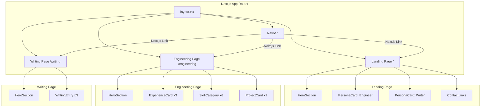

# Design Document: Portfolio Site

## Overview

A multi-page portfolio website for Basil Reji, built with Next.js 14+ (App Router) and React. The site presents two distinct personas — a full-stack engineer and a writer/artist — connected by a shared landing page and persistent navigation. All pages are statically exported at build time (`output: 'export'`), ensuring fast load times and simple hosting.

The design prioritizes component reuse, accessibility (semantic HTML, keyboard navigation, ARIA labels, contrast ratios), responsive layouts, and client-side routing via Next.js App Router.

### Technology Choices

| Concern | Choice | Rationale |
|---|---|---|
| Framework | Next.js 14+ (App Router) | File-system routing, static export, React Server Components, built-in optimizations |
| UI Library | React 18+ | Component-based architecture, hooks for state management |
| Styling | CSS Modules | Scoped styles per component, no runtime CSS-in-JS overhead, works with static export |
| Routing | Next.js App Router | File-system based routing (`/`, `/engineering`, `/writing`), client-side transitions via `<Link>` |
| Hosting | Static file hosting (Vercel, GitHub Pages, Netlify, or S3) | `next export` produces static HTML/CSS/JS; no server runtime needed |
| Language | TypeScript | Type safety for component props and data models |

## Architecture

The application uses the Next.js App Router with the following file structure:

```
src/
├── app/
│   ├── layout.tsx            — Root layout (Navigation_Bar, shared metadata, global styles)
│   ├── page.tsx              — Landing_Page (/)
│   ├── engineering/
│   │   └── page.tsx          — Engineering_Page (/engineering)
│   └── writing/
│       └── page.tsx          — Writing_Page (/writing)
├── components/
│   ├── Navbar.tsx            — Navigation_Bar component (shared across all pages)
│   ├── PersonaCard.tsx       — Persona_Card for landing page
│   ├── ContactLinks.tsx      — Reusable Contact_Link group
│   ├── HeroSection.tsx       — Reusable Hero_Section (accepts title, subtitle, summary props)
│   ├── ExperienceCard.tsx    — Experience_Card component
│   ├── SkillCategory.tsx     — Skill_Category display component
│   ├── ProjectCard.tsx       — Project_Card component
│   └── WritingEntry.tsx      — Writing_Entry component
├── data/
│   ├── experience.ts         — Experience entries data
│   ├── skills.ts             — Skills data grouped by category
│   ├── projects.ts           — Project entries data
│   └── writing.ts            — Writing/artistic entries data
└── styles/
    └── globals.css           — Global styles, CSS custom properties, reset
```



### Routing

Next.js App Router provides file-system-based routing:

| Route | File | Page |
|---|---|---|
| `/` | `app/page.tsx` | Landing_Page |
| `/engineering` | `app/engineering/page.tsx` | Engineering_Page |
| `/writing` | `app/writing/page.tsx` | Writing_Page |

All navigation uses the Next.js `<Link>` component for client-side transitions without full page reloads.

### Navbar Active State

The `Navbar` component uses the `usePathname()` hook from `next/navigation` to determine the current route and apply an `active` CSS class to the matching navigation link.

### Hamburger Menu

On viewports ≤ 768px, the nav links are hidden behind a hamburger icon. The `Navbar` component manages an `isOpen` state via `useState`. Clicking the icon toggles visibility. Clicking a nav link or navigating also closes the menu.

## Components and Interfaces

### Shared Components

```typescript
// components/Navbar.tsx
interface NavbarProps {}
// Uses usePathname() for active link highlighting
// Manages mobile menu state with useState
// Renders Next.js <Link> components for /, /engineering, /writing

// components/HeroSection.tsx
interface HeroSectionProps {
  name: string;
  title: string;
  summary?: string;
  showContactLinks?: boolean;
}

// components/ContactLinks.tsx
interface ContactLinksProps {
  email: string;
  phone: string;
  github: string;
}

// components/PersonaCard.tsx
interface PersonaCardProps {
  title: string;        // e.g. "Full-Stack Engineer"
  description: string;  // Brief description of this persona
  href: string;         // e.g. "/engineering"
  icon?: string;        // Optional icon/emoji
}
```

### Engineering Page Components

```typescript
// components/ExperienceCard.tsx
interface ExperienceCardProps {
  jobTitle: string;
  company: string;
  duration: string;
  location: string;
  responsibilities: string[];
}

// components/SkillCategory.tsx
interface SkillCategoryProps {
  name: string;
  skills: string[];
}

// components/ProjectCard.tsx
interface ProjectCardProps {
  name: string;
  techStack: string[];
  duration: string;
  accomplishments: string[];
}
```

### Writing Page Components

```typescript
// components/WritingEntry.tsx
interface WritingEntryProps {
  title: string;
  description: string;
  category: string;     // e.g. "poetry", "essay", "short story", "visual art"
  date?: string;
  link?: string;        // Optional external link to the full piece
}
```

### Contact Links

| Type | href pattern | Behavior |
|---|---|---|
| Email | `mailto:[email]` | Opens default email client |
| Phone | `tel:+91[phone_number]` | Initiates phone call |
| GitHub | `https://github.com/capdevbasil` | Opens in new tab (`target="_blank"` + `rel="noopener noreferrer"`) |

## Data Models

All data is stored in TypeScript files under `src/data/` and imported at build time. No runtime API calls.

### Experience Entry

```typescript
// data/experience.ts
interface ExperienceEntry {
  jobTitle: string;
  company: string;
  duration: string;
  location: string;
  responsibilities: string[];
}

const experiences: ExperienceEntry[] = [
  {
    jobTitle: "Senior Fullstack Developer",
    company: "Sanmitsude Experts",
    duration: "May 2025 – Present",
    location: "Sharjah, UAE",
    responsibilities: []  // To be filled with actual responsibilities
  },
  {
    jobTitle: "Senior React Developer",
    company: "Zora Technologies",
    duration: "Nov 2024 – May 2025",
    location: "Trivandrum, Kerala",
    responsibilities: []
  },
  {
    jobTitle: "Senior Engineer",
    company: "dbi.ai",
    duration: "Jul 2020 – Nov 2024",
    location: "Kochi, Kerala",
    responsibilities: []
  }
];
```

### Skill Categories

```typescript
// data/skills.ts
interface SkillCategory {
  name: string;
  skills: string[];
}

const skillCategories: SkillCategory[] = [
  { name: "Frontend", skills: ["HTML5", "CSS3", "JavaScript (ES6+)", "TypeScript", "React", "Angular", "VueJS", "Redux", "React Native", "Flutter", "Dart"] },
  { name: "Backend", skills: ["Node.js", "Python", "Java", "Express", "RESTful APIs", "GraphQL"] },
  { name: "Database", skills: ["SQL (PostgreSQL, MySQL)", "NoSQL (MongoDB, Redis)"] },
  { name: "DevOps", skills: ["Git/GitHub/GitLab", "Bitbucket", "Docker", "Kubernetes", "AWS", "Azure", "CI/CD"] },
  { name: "Unit Testing", skills: ["Jest", "Mocha"] },
  { name: "Developer Tools", skills: ["VS Code", "Cursor", "Postman", "Jira", "npm/yarn", "webpack", "Babel"] }
];
```

### Project Entry

```typescript
// data/projects.ts
interface ProjectEntry {
  name: string;
  techStack: string[];
  duration: string;
  accomplishments: string[];
}

const projects: ProjectEntry[] = [
  {
    name: "Motorhub",
    techStack: ["NextJS", "NodeJS", "AWS", "Postgres"],
    duration: "May 2025 – Present",
    accomplishments: []  // To be filled
  },
  {
    name: "Zora App",
    techStack: ["React", "Clerk", "Mantine", "SWR"],
    duration: "November 2024 – May 2025",
    accomplishments: []
  }
];
```

### Writing Entry

```typescript
// data/writing.ts
interface WritingEntry {
  title: string;
  description: string;
  category: string;
  date?: string;
  link?: string;
}

const writingEntries: WritingEntry[] = [
  // Placeholder entries — to be populated by the developer
  {
    title: "Sample Piece",
    description: "A placeholder for the first writing entry.",
    category: "essay",
    date: "2025"
  }
];
```

## Correctness Properties

*A property is a characteristic or behavior that should hold true across all valid executions of a system — essentially, a formal statement about what the system should do.*

### Property 1: Navigation active state matches current route

*For any* page in the Portfolio_Site, the navigation link whose `href` matches the current pathname (from `usePathname()`) should have the `active` class, and all other nav links should not.

**Validates: Requirements 2.4**

### Property 2: Client-side navigation preserves Navbar state

*For any* navigation between pages using the Next.js `<Link>` component, the Navbar component should remain mounted (not re-rendered from scratch), and the active link should update to reflect the new route.

**Validates: Requirements 2.3, 10.4**

### Property 3: Experience card completeness

*For any* experience entry in the data set, the rendered ExperienceCard should contain the job title, company name, employment duration, location, and a non-empty list of responsibilities.

**Validates: Requirements 4.2, 4.3**

### Property 4: Skill categorization correctness

*For any* skill in the data set, that skill should appear in the DOM inside the element corresponding to its assigned Skill_Category, and nowhere else.

**Validates: Requirements 5.1, 5.3**

### Property 5: Project card completeness

*For any* project entry in the data set, the rendered ProjectCard should contain the project name, all tech stack items, the project duration, and a non-empty list of accomplishments.

**Validates: Requirements 6.2**

### Property 6: Hamburger menu toggle round-trip

*For any* initial state of the mobile menu (open or closed), toggling it once should invert the visibility, and toggling it a second time should restore the original state.

**Validates: Requirements 2.6, 8.5**

### Property 7: Persona card navigation correctness

*For any* Persona_Card on the Landing_Page, clicking it should navigate to the route specified in its `href` prop, and the resulting page should render the correct persona content.

**Validates: Requirements 1.4, 1.5**

### Property 8: Interactive elements are keyboard-accessible with focus indicators

*For any* interactive element (links, buttons) across all pages, the element should be reachable via Tab key (tabindex ≥ 0 or naturally focusable) and should have a visible focus style when focused.

**Validates: Requirements 9.2, 9.3**

### Property 9: ARIA labels on interactive navigation and contact elements

*For any* Contact_Link or navigation link element across all pages, the element should have a non-empty `aria-label` attribute.

**Validates: Requirements 9.4**

### Property 10: Writing entry completeness

*For any* writing entry in the data set, the rendered WritingEntry should contain the title, description, and category.

**Validates: Requirements 7.4**

## Error Handling

| Scenario | Handling |
|---|---|
| CSS Modules fail to load | Content remains readable via semantic HTML; layout degrades gracefully |
| JavaScript fails to load | Next.js static HTML still renders all content; navigation falls back to full page loads via `<a>` tags; hamburger menu stays in default state |
| External link unreachable (GitHub) | Standard browser behavior; no custom handling needed |
| Invalid route accessed | Next.js default 404 page; can be customized via `app/not-found.tsx` |
| Writing page has no entries | The Writing_Page displays a friendly message indicating content is coming soon |

## Testing Strategy

### Unit Tests (Jest + React Testing Library)

Unit tests verify specific, concrete expectations:

- Landing page renders "Basil Reji" as primary heading (Req 1.1)
- Landing page renders two Persona_Cards with correct links (Req 1.3, 1.4, 1.5)
- Contact links exist for email (mailto:), phone (tel:), GitHub (https://github.com/capdevbasil) on Landing and Engineering pages (Req 1.6–1.9, 3.3–3.6)
- Navbar renders links to `/`, `/engineering`, `/writing` (Req 2.2)
- Navbar highlights active link based on current route (Req 2.4)
- Engineering page hero displays name and "Full-Stack Engineer" title (Req 3.1)
- Engineering page hero displays professional summary (Req 3.2)
- Experience entries appear in reverse chronological order (Req 4.1)
- All three experience entries are present (Req 4.4)
- All six skill categories are present (Req 5.2)
- Both projects are present (Req 6.1, 6.3)
- Writing page renders hero with "Writer & Artist" title (Req 7.1)
- Writing page renders WritingEntry components (Req 7.3)
- Semantic HTML elements (nav, main, section, article, header) exist on all pages (Req 9.1)
- All pages use static data imports, no runtime fetch calls (Req 10.2)

### Responsive Layout Tests (example-based, specific breakpoints)

- At 320px width: single-column layout, hamburger icon visible on all pages (Req 8.1, 8.4)
- At 768px width: single-column layout, hamburger icon visible (Req 8.1, 8.4)
- At 1024px width: multi-column layout, full nav visible (Req 8.2)

### Property-Based Tests (fast-check)

Library: [fast-check](https://github.com/dubzzz/fast-check) (JavaScript property-based testing library)

Each property test runs a minimum of 100 iterations. Each test is tagged with a comment referencing its design property.

- **Feature: portfolio-page, Property 1: Navigation active state matches current route** — Generate random pathnames from the set of valid routes; verify the Navbar applies `active` class to exactly the correct link.
- **Feature: portfolio-page, Property 3: Experience card completeness** — Generate random ExperienceEntry objects; render ExperienceCard; verify all required fields appear in the output.
- **Feature: portfolio-page, Property 4: Skill categorization correctness** — Generate random skill-to-category mappings; render SkillCategory components; verify each skill appears only within its correct category container.
- **Feature: portfolio-page, Property 5: Project card completeness** — Generate random ProjectEntry objects; render ProjectCard; verify all required fields appear in the output.
- **Feature: portfolio-page, Property 6: Hamburger menu toggle round-trip** — Generate random initial states (open/closed); toggle twice; verify state returns to original.
- **Feature: portfolio-page, Property 8: Interactive elements are keyboard-accessible with focus indicators** — Generate random sets of interactive elements; verify each is tabbable and has a focus style.
- **Feature: portfolio-page, Property 9: ARIA labels on interactive navigation and contact elements** — Generate random sets of nav/contact link elements; verify each has a non-empty aria-label.
- **Feature: portfolio-page, Property 10: Writing entry completeness** — Generate random WritingEntry objects; render WritingEntry; verify all required fields appear in the output.
